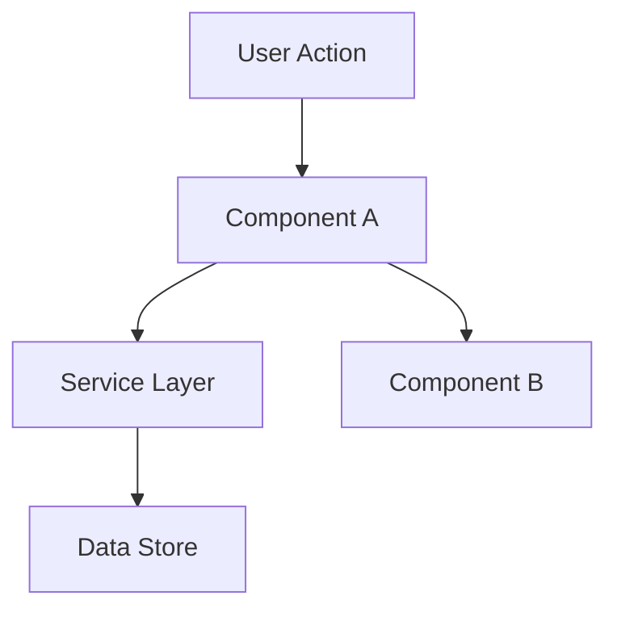

# Craft — Plan

**Goal**
Define HOW to build it. Architecture, components, what to reuse and produce the `.specs/features/[slug]/plan.md` document.
To make this plan document, reads `spec.md` (required) to have context.

## Process

### 1. Load context
  Load `.specs/features/[slug].spec.md` before planning it. If `.specs/features/[feature]/context.md` exists, load it too — it contains implementation decisions that constrain the plan (layout choices, behavior preferences, interaction patterns). Decisions marked as "Agent's Discretion" are yours to decide.

  This `spec.md` file need exist. if doesn't, stop and ask the user to run Specify.
  To run Specify is: `Start specify [slug]`

  **CRITICAL: NEVER assume or fabricate information.** If you cannot find an answer through the chain, explicitly say "I don't know" or "I couldn't find documentation for this". Inventing an API, a pattern, or a behavior that doesn't exist is far worse than admitting uncertainty. Wrong assumptions propagate through plan → tasks → implementation and cause cascading failures.

### 2. Define Architecture

  Overview of how components interact. Use mermaid diagrams when helpful. Before creating any diagrams, check if the `mermaid-studio` skill is available (see Skill Integrations in SKILL.md).

### 3. Identify Code Reuse

  **CRITICAL**: What existing code can we leverage? This saves tokens and reduces errors.

  If `.specs/codebase/CONCERNS.md` exists, check it before planning. Any component flagged as fragile, carrying tech debt, or having test coverage gaps requires extra care in the plan document

### 4. Define Components and Interfaces

  Each component: Purpose, Location, Interfaces, Dependencies, What it reuses.

### 5. Define Data Models

  If the feature involves data, define models before implementation.

### 6. Trigger the next step

The next step in our workflow is tasks.

1. Tell the user the plan is ready. Show the completed `plan.md`.
2. Wait for explicit user input. Two outcomes:
   - **Approved** → trigger Tasks with `Start tasks [slug]`.
   - **Rejected** → restructure the plan document based on the user's feedback. Do not iterate inside Tasks.
3. The user types the trigger — the agent never auto-triggers Tasks.

---

## Template: `.specs/[feature]/plan.md`

````markdown
# [Feature] Plan

**Spec**: `.specs/[feature]/spec.md`
**Status**: Draft | Approved

---

## Architecture Overview

[Brief description of the architecture approach]


````

---

## Code Reuse Analysis

### Existing Components to Leverage

| Component            | Location            | How to Use                |
| -------------------- | ------------------- | ------------------------- |
| [Existing Component] | `src/path/to/file`  | [Extend/Import/Reference] |
| [Existing Utility]   | `src/utils/file`    | [How it helps]            |
| [Existing Pattern]   | `src/patterns/file` | [Apply same pattern]      |

### Integration Points

| System         | Integration Method                      |
| -------------- | --------------------------------------- |
| [Existing API] | [How new feature connects]              |
| [Database]     | [How data connects to existing schemas] |

---

## Components

### [Component Name]

- **Purpose**: [What this component does - one sentence]
- **Location**: `src/path/to/component/`
- **Interfaces**:
  - `methodName(param: Type): ReturnType` - [description]
  - `methodName(param: Type): ReturnType` - [description]
- **Dependencies**: [What it needs to function]
- **Reuses**: [Existing code this builds upon]

### [Component Name]

- **Purpose**: [What this component does]
- **Location**: `src/path/to/component/`
- **Interfaces**:
  - `methodName(param: Type): ReturnType`
- **Dependencies**: [Dependencies]
- **Reuses**: [Existing code]

---

## Data Models (if applicable)

### [Model Name]

```typescript
interface ModelName {
  id: string
  field1: string
  field2: number
  createdAt: Date
}
```

**Relationships**: [How this relates to other models]

### [Model Name]

```typescript
interface AnotherModel {
  id: string
  // ...
}
```

---

## Error Handling Strategy

| Error Scenario | Handling      | User Impact      |
| -------------- | ------------- | ---------------- |
| [Scenario 1]   | [How handled] | [What user sees] |
| [Scenario 2]   | [How handled] | [What user sees] |

---

## Tech Decisions (only non-obvious ones)

| Decision          | Choice          | Rationale     |
| ----------------- | --------------- | ------------- |
| [What we decided] | [What we chose] | [Why - brief] |

---

## Tips

- **Load context first** — Reads spec.md and context.md to have fully understading what to build
- **Reuse is king** — Every component should reference existing patterns
- **Interfaces first** — Define contracts before implementation
- **Keep it visual** — Diagrams save 1000 words (check mermaid-studio skill in Skill Integrations)
- **Small components** — If component does 3+ things, split it
- **Check CONCERNS.md** — If it exists, flag fragile areas the plan must address
- **Confirm before Tasks** — User approves plan before breaking into tasks
